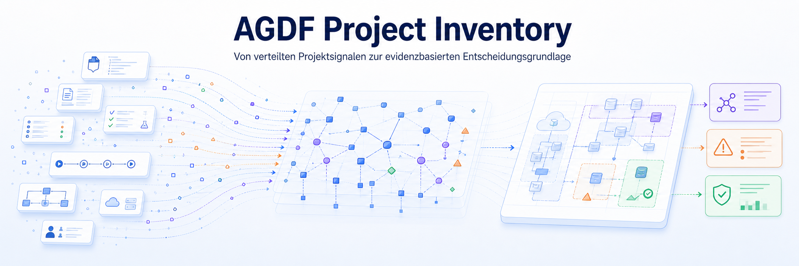

# AGDF Project Inventory

AGDF Project Inventory ist ein deutscher Diskussionsentwurf. Er beschreibt nachvollziehbare Bestandsaufnahmen von Softwareprojekten mit Hilfe von Agenten und KI.

## Dieser Diskussionsentwurf in einem Satz

Projektbestandsaufnahmen mit KI brauchen mehr als Zusammenfassungen. Sie brauchen klare Regeln. Fakten, Deutungen, Wissenslücken und Empfehlungen müssen mit prüfbaren Belegen verbunden sein.

Das fachliche Wissen ist der eigentliche Schatz eines Projekts. Project Inventory soll dieses Wissen auffindbar, prüfbar und für einen konkreten Zweck nutzbar machen.

## Status

Dieses Repository ist ein Diskussionsentwurf. Es beschreibt eine Annahme, mögliche Grundsätze und offene Fragen. Es ist keine freigegebene Produktspezifikation. Es ist auch keine Zusage für eine Umsetzung. Der Nutzen in echten Projekten ist noch nicht belegt.

Die Dokumente unterscheiden Beobachtungen, Deutungen, vorgeschlagene Regeln und offene Fragen. Eine vorgeschlagene Regel beschreibt den Entwurf. Sie ist keine Beobachtung eines bereits vorhandenen Produkts.

Zuerst soll geprüft werden, ob eine Projektbestandsaufnahme mit AGDF Unternehmen einen eigenen und wiederholbaren Nutzen bietet.

## Erste 5 Minuten

So bekommst du schnell einen Überblick.

1. Lies die Ausgangsbeobachtung und Kernthese im [Manifest](docs/00-manifest.md).
2. Schau dir das Evidenzmodell, den Ablauf und die Ergebnisse im [Überblick](docs/01-project-inventory-ueberblick.md) an.
3. Lies im Dokument [Aufbau und Verantwortung](docs/02-aufbau-und-verantwortung.md), wie ein Inventory Run fachlich aufgebaut ist.

Danach solltest du diese Fragen beantworten können.

- Welchem Hauptzweck soll eine Project Inventory dienen?
- Wie werden Fakten, Interpretationen, Unbekanntes und Empfehlungen getrennt?
- Welche Rolle übernimmt AGDF und welche ausdrücklich nicht?
- Wie wird aus Quellen und Belegen ein gemeinsamer Bericht?

## Warum es dieses Projekt gibt

Ausgangspunkt des Entwurfs ist eine Arbeitshypothese. Projektbestandsaufnahmen entstehen oft unter Zeitdruck. Die Informationen sind verteilt und unvollständig. KI kann diese Quellen schnell auswerten und gut zusammenfassen. Eine gute Darstellung ist aber noch keine belastbare Bestandsaufnahme.

Der Entwurf geht von einer Arbeitshypothese aus. Ein eigener Auftrag für Aufräumen und Wissenspflege ist in Projekten nicht immer erkennbar. Das kann bei einer Kostenstelle ebenso vorkommen wie bei einem Profit Center. Die wirtschaftliche Einordnung erklärt den Grund dafür nicht. Project Inventory soll deshalb auch dann einen nutzbaren Stand liefern, wenn keine spätere Bereinigung beauftragt ist.

Der Entwurf fragt deshalb nach klaren Regeln. Die Herkunft, die Reichweite und die Unsicherheit von Aussagen müssen sichtbar bleiben. So kann aus fachlichen und technischen Beobachtungen ein prüfbarer Stand für Entscheidungen, laufende Arbeit und dauerhaftes Projektwissen entstehen.

Bei Änderungen mit KI besteht ein weiteres Risiko. Ohne ausreichenden Projektkontext kann eine neue Lösung entstehen, obwohl bereits eine passende Lösung oder ein verantwortlicher Erweiterungspunkt vorhanden ist. Das kann unnötige Änderungen und parallele Verantwortungen erzeugen.

Project Inventory soll die KI nicht nur begrenzen. Es soll ihr helfen, das bestehende Projekt zu verstehen. AGDF steuert, ob eine Änderung zulässig ist. Das Projektgedächtnis hilft zu erkennen, wo und wie sie in der bestehenden Lösung erfolgen sollte.

## Was der Entwurf vorschlägt

Project Inventory ist hier keine einfache Liste von Dateien, Technik oder Abhängigkeiten. Es ist ein geordnetes Bild des Projekts. Beobachtete Fakten, Deutungen, unbekannte Bereiche und Empfehlungen werden mit Belegen verbunden.

Project Inventory rekonstruiert aus zugänglichen Projektspuren schrittweise einen evidenzbasierten Projektkontextgraphen. Der Inventory Report nutzt einen geprüften Ausschnitt für einen bestimmten Auftrag und Zeitpunkt.

Bestehende fachliche Quellen bleiben für ihr Wissen verantwortlich. Der Inventory Report führt die Bewertung für den jeweiligen Auftrag. Daraus entstehen kürzere Darstellungen. Dazu gehören eine Zusammenfassung für das Management, ein Maßnahmenkatalog, eine Architekturansicht, eine Risikoansicht oder eine Präsentation.

## Rolle von AGDF

Der Entwurf ist als ergänzendes Plugin für [AGDF](https://agdf.iself.eu/) vorgesehen. AGDF soll die Regeln für Freigaben, Belege und Lieferung bereitstellen. Project Inventory soll diese Regeln nicht ein zweites Mal aufbauen.

Beide Projekte können durch ein gemeinsames Projektgedächtnis zusammenarbeiten. Project Inventory baut Wissen aus belegten Projektspuren auf und pflegt es. AGDF nutzt den passenden Ausschnitt für eine konkrete Aufgabe und lässt wichtige Aussagen erneut an den verantwortlichen Quellen prüfen. Neue dauerhaft nutzbare Erkenntnisse können danach in das Projektgedächtnis zurückfließen.

Das Projektgedächtnis ist kein Ersatz für die verantwortlichen Projektquellen. Der AGDF Context Graph bleibt ebenfalls getrennt. Er enthält nur Wissen, das für gesteuerte Veränderungen und spätere Lieferentscheidungen wichtig ist.

Eine allgemeine Projektbestandsaufnahme ist auch ohne AGDF möglich. Ein durch AGDF gesteuerter Inventory Run braucht dagegen eine passende Installation von AGDF.

## Dokumente

Folgende Reihenfolge ist empfohlen.

1. [00 Manifest](docs/00-manifest.md)
2. [01 Überblick](docs/01-project-inventory-ueberblick.md)
3. [02 Aufbau und Verantwortung](docs/02-aufbau-und-verantwortung.md)
4. [03 Pilotversuch](docs/03-pilotversuch.md)

## Welche Fragen sind interessant?

- Welchem Hauptzweck soll eine Project Inventory dienen?
- Welche Belege braucht eine belastbare Bestandsaufnahme mindestens?
- Wann genügt ein kompakter Ansatz und wann ist eine strukturierte Tiefe erforderlich?
- Wie werden technische Findings ohne Scheingenauigkeit priorisiert?
- Welchen Nutzen hat der Bericht, wenn niemand eine Bereinigung beauftragt?
- Woran lässt sich in realen Projekten messen, ob der Ansatz bessere Entscheidungen ermöglicht?

Bis diese Fragen ausreichend geklärt und ein User Requirement Scope freigegeben ist, bleibt dieses Repository bewusst ein Diskussionsentwurf.
